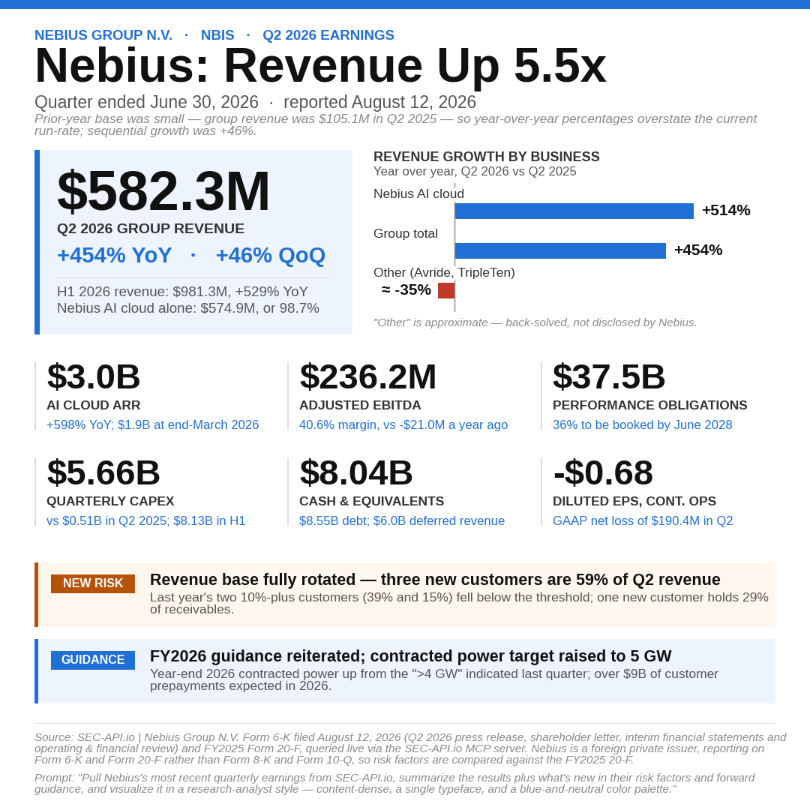

## Prompt

```markdown
Pull Nebius most recent quarterly earnings from SEC-API.io (their latest 8-K, Item 2.02 press release exhibit) and build me a single square (1080×1080px) graphic, summarizing the results plus what's new in their risk factors and forward guidance. Tell me which filings you used.

Follow this exact visual template:

**Format:** Square, 1080×1080px (10.8×10.8in at 100dpi). White background. A solid blue accent bar (#1f6fd6) across the very top, ~12px tall.

**Font:** Arial throughout (or a metric-compatible equivalent like Liberation Sans if Arial isn't available) — one typeface for the whole graphic, varying only by size/weight/color, never mixing fonts.

**Color palette (use only these):**

- Blue (primary accent, links, guidance callout): `#1f6fd6`
- Dark near-black (headlines, big numbers): `#111111`
- Medium gray (subtitle, tile labels): `#555555` / `#333333`
- Light gray (source line, dividers): `#888888` / `#dddddd`
- Light blue tint (hero stat background): `#eef4fd`
- Amber (new-risk callout): border/chip `#b45309`, background `#fff7ed`
- Red (only if a segment is declining, for a diverging bar): `#c0392b`

**Section order, top to bottom:**

1. Eyebrow line (small caps-style, bold, blue): `COMPANY NAME  ·  TICKER  ·  [PERIOD] EARNINGS`
2. Headline (large, bold, black): `Company: [short punchy 2-4 word takeaway]` — e.g. "Record Profits," "AI Orders Surge." Keep it factual, not hype.
3. Subtitle (gray, regular): "Quarter [and fiscal year] ended [date]"
4. One italic gray footnote line _only if needed_ — e.g. explaining an off-calendar fiscal year, or explaining why a YoY comparison looks extreme due to a prior-year base effect. Skip this line if it doesn't apply.
5. A two-column row: on the left, a light-blue hero stat card with a blue left accent stripe containing the single biggest headline number (large bold), its label, its YoY or QoQ change (in blue), and a secondary total line below in gray. On the right, a horizontal bar chart of segment/product growth (whichever cut — YoY or QoQ — is more meaningful given the numbers; note which one you used in the chart title). If any segment is negative, use a proper zero-anchored diverging bar (not just a shorter bar), with declines in red.
6. A 3-column × 2-row grid of six supporting stat tiles, each with a thin left divider line, a big bold number on top, a bold label below it, and a blue sub-note (context or comparison) at the bottom.
7. Two full-width callout bars, stacked: an amber "NEW RISK" bar summarizing the single most notable new/changed item from the latest 10-Q's Item 1A (compared against the prior 10-K), and a blue "GUIDANCE" bar summarizing forward guidance. Each has a small colored pill/chip label on the left and one bold line of text.
8. A thin gray divider rule, then two small italic gray footer lines: a Source line citing the specific filings used (e.g. "Source: SEC-API.io | [Company] Form 8-K (Item 2.02) and Form 10-Q, queried live via the SEC-API.io MCP server"), and a Prompt line quoting the request that generated the graphic, ending with the same styling instruction: _"...and visualize it in a research-analyst style — content-dense, a single typeface, and a blue-and-neutral color palette."_

**Density rules:** No wasted white space — fit content snugly, then adjust the canvas height (not the margins) until there's only a small buffer (~0.1–0.3in) below the footer. Numbers and labels should be large enough to read at LinkedIn feed size, but the whole thing should read as dense and information-rich, not sparse. No stray colors outside the palette above, no decorative icons, no drop shadows — flat, plain, research-report aesthetic.
```

## Result


